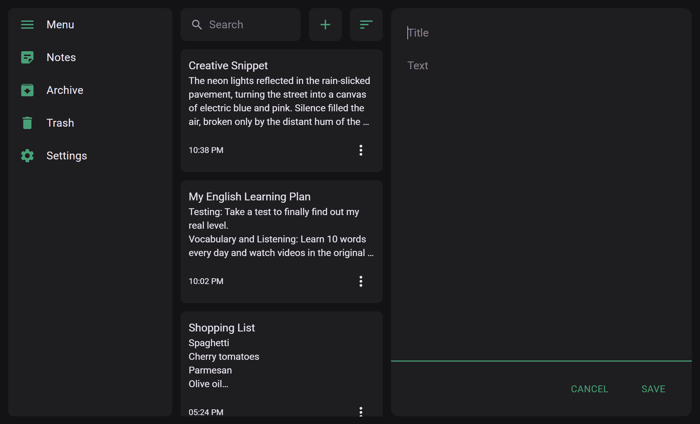
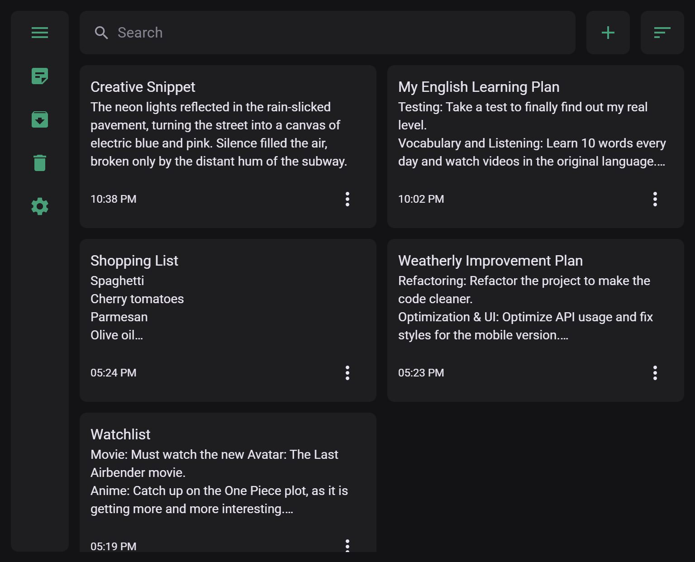
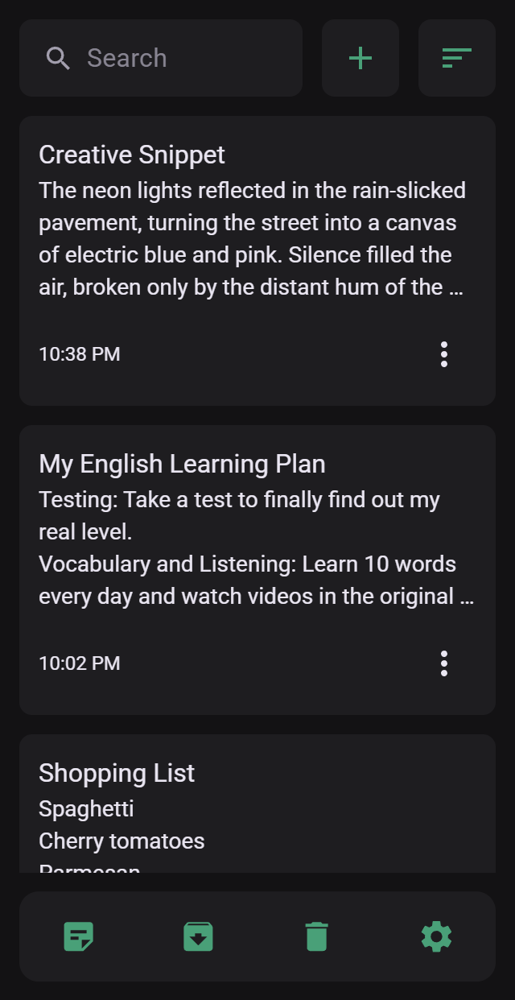

# About CtrLNote

[**CtrLNote**](https://andrii-kaliuha.github.io/CtrLNote/#/notes) is a web application for creating, editing, and organizing notes with a minimalist and customizable interface.

## 📷 Screenshots

<div align="center">
  <br>
  <h3>Desktop View (1024px)</h3>
  

  <h3>Tablet View (768px)</h3>
  

  <h3>Mobile View (320px)</h3>
  
  <br>
</div>

## ✨ Features

- **CRUD Operations** — Create, Read, Update, and Delete notes
- **Organization** — Archive and Trash system for better workflow
- **Search & Filters** — Quick search and sorting by title and date
- **Localization** — Full interface localization for UA, EN, and PL users
- **PWA Support** — Installable PWA with offline support
- **Customization** — Theme customization and dynamic accent colors

## 🛠️ Tech Stack

- **Frontend:** React, TypeScript
- **State Management:** Redux Toolkit
- **Styling:** TailwindCSS, Material UI
- **Localization:** react-i18next
- **Build Tooling:** Vite

## 📁 Project Structure

```text
src/
├── components/        # UI components (Note, Navigation, Editor, etc.)
├── pages/             # Application views (Notes, Archive, Trash, Settings)
├── routes/            # Routing configuration
├── shared/
│   ├── hooks/         # Custom hooks
│   ├── i18n/          # Localization (UA, EN, PL)
│   ├── style/         # Global styles/config
│   ├── types/         # TypeScript types
│   ├── ui/            # Reusable UI (Button, Switch, Input)
│   └── utils/         # Helper functions
├── store/
│   ├── slices/        # Redux slices
│   └── store.ts       # Store configuration
├── App.tsx
└── main.tsx
```

## ⚙️ Installation & Setup

```bash
# Clone the repository
git clone https://github.com/andrii-kaliuha/CtrLNote.git

# Go to project folder
cd CtrLNote

# Install dependencies
npm install

# Run development server
npm run dev
```

## 📦 Build

```bash
npm run build
```

## 🧠 Future Improvements

- Import / Export notes
- IndexedDB persistence
- Tags & folders
